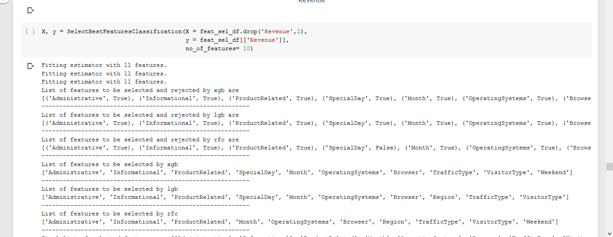
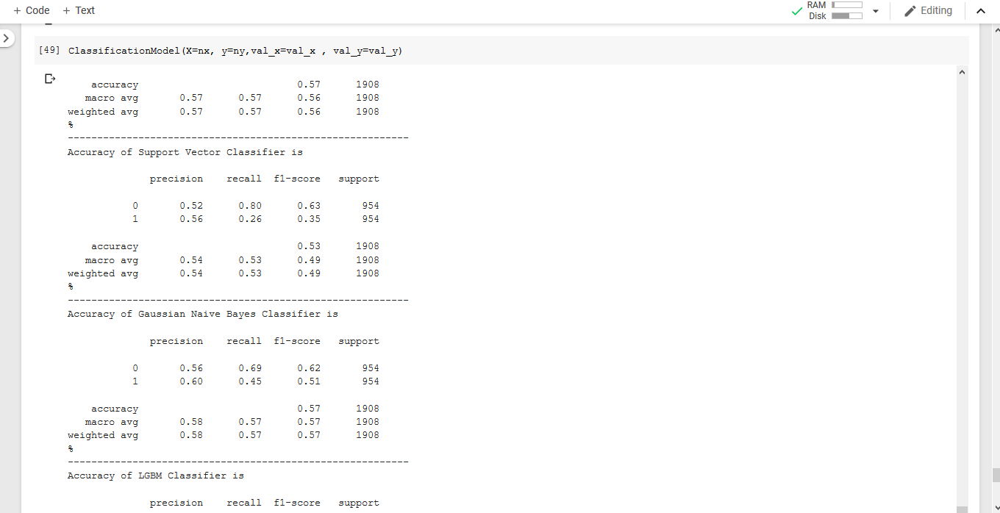

# Machine_Learning_Driver_Code(Only for Supervised Classification)

 Recursive Feature Selection
## It is a simple set of of functions that can be used to create a predictive model while training on a dataset using several different training algorithms and pre processing techniques.

 Classification
### Pre Processed with Standard Scaling and Label Encoding.
## Algorithms used for Feature Extraction :
* Recursive Feature Extraction using XGB Classifier
* Recursive Feature Extraction using LGBM Classifier
* Recursive Feature Extraction using Random Forest Classifier

## Algorithms used for model Training
* Classification with ExtraTree Classifier()
* Classification with Random Forest Classifier()
* Classification with XGBoost Classifier()
* Classification with Decision Tree Classifier()
* Classification with Multi Layer Perceptron Classifier()
* Classification with Light GBM Classifier()
* Classification with Ada Boost Classifier()
* Classification with K Nearest Neighbors Classifier()
* Classification with Support Vector Machine Classifier()
* Classification with Gaussian NB Classifier()
* Classification with Ada Boost Classifier()

 
<i>In collaboration with <a href = "https://github.com/Mystic-Valley">Shushrut Gupta</a></i>
